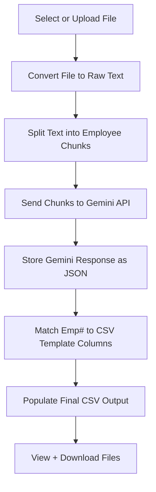

# 🧾 Automated Payroll Data Processor

This Streamlit app automates payroll data extraction and transformation using LLMs (Gemini) and structured templates.

---

## 🚀 Features

- ✅ Upload & select raw Excel payroll registers
- ✅ Use pre-defined CSV templates for output formatting
- ✅ Automatically chunk employee blocks from raw data
- ✅ Send employee chunks to Gemini API for structured JSON extraction
- ✅ Populate final CSV using the structured JSON
- ✅ View real-time logs for each processing step
- ✅ Download structured JSON and final CSV output

---

## 📊 Workflow



---


## 📂 Folder Structure
```protobuf
Data/
│
├── input_files/ # Raw payroll register Excel files (.xlsx)
├── CSV_Templates/ # Predefined CSV templates (.csv)
├── raw_chunks/ # Output: Raw employee text chunks (JSON)
├── output/
│ ├── LLM/ # Output: Gemini-extracted structured JSON
│ └── populated_files/ # Output: Final populated CSV
└── logs/ # Logs for failed chunks
```

---

## 🛠️ Tech Stack

- **Frontend**: [Streamlit](https://streamlit.io/)
- **Backend**: Python (with `openpyxl`, `requests`, `dotenv`)
- **LLM**: Gemini 2.0 Flash API
- **CSV/Excel**: `pandas`, `csv`, `openpyxl`

---

## 📋 How it Works

1. **Select Files**  
   Choose a payroll register (`.xlsx`) and a CSV template.

2. **Chunking**  
   The Excel file is parsed into per-employee text chunks.

3. **LLM Parsing**  
   Each chunk is sent to Gemini API to extract structured JSON.

4. **Populate CSV**  
   A final payroll CSV is generated by mapping JSON to the selected template.

5. **Review + Download**  
   View the parsed data, logs, and download the final files.

---

## ▶️ How to Run

```bash
pip install -r requirements.txt
streamlit run app.py

```

Make sure you have a .env file with your Gemini API key:
```bash
GEMINI_API_KEY=your_gemini_key_here
```
---
## 📌 To Do
 - Add PDF support with chunking from raw text

 - Validate extracted JSON fields

 - Add authentication & versioned file storage
